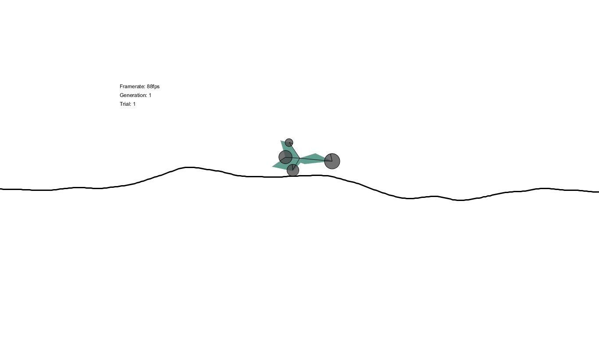
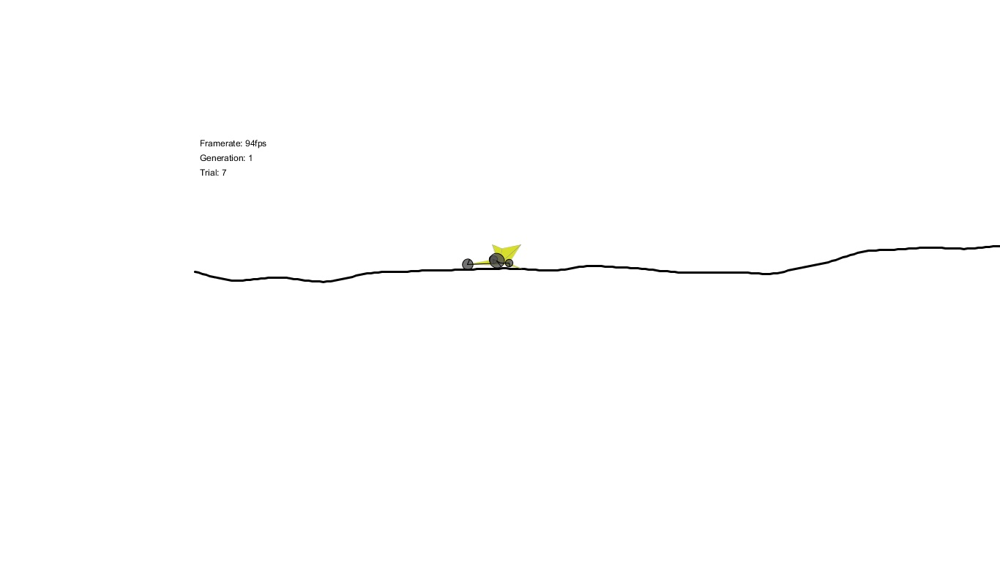

# BoxCar2D
---
This is a computational intelligence car evolution project, a replica of [BoxCar2D](http://www.boxcar2d.com/) made entirely in Processing and a Java wrapper by Daniel Shiffman for the Box2D physics engine.

### How cars are built
Each car consists of one central vertex and eight other vertices at random distances from the central vertex. Each triangle so formed is  initialized as a separate Box2D body to allow concave polygons. Each vertex has a 60% probability of spawning a wheel. The radius of the wheel is also selected at random. Wheels are built from the CircleShape class of Box2D and have a density and friction of 1 and a coefficient of restitution of 0.5

### The DNA sequence
The DNA consists of 36 values between 0 and 1. Let's divide the DNA array into sequences of 4 elements. These four elements together make up the properties of a vertex. The first 32 elements thus encode the genetic information for the eight vertices. The last four elements decide the color (R, G, B, A values). The first two elements of a vertex encode the magnitude and direction of the position vector relative to the fixed origin. The third element decides whether the vertex gets a wheel. The fourth element decides the radius of the wheel if any.

### How surfaces are built
The surface (or the track) is built using the ChainShape class in Box2D. The vertices for the chain shape are generated procedurally using Perlin Noise. The surface is the same for all genomes of a population to maintain even difficulty for all genomes. It is changed after every population though. As the track progresses, the offset of the perlin noise function is changed due to which, the later parts of the track becomes more bumpy and difficult to maneuvre.

### Algorithm
Each car has a DNA sequence which is optimized over using a Genetic Algorithm. Each generation has 20 genomes. The fitness is calculated by distance of travel. Fitnesses are mapped to the DNA and these DNA arrays are selected according to their weights and a mating-pool is generated. Two random elements from the mating pool are selected. Care is taken to prevent both genomes being identical. There is a choice between split recombination and uniform recombination. By default, the DNA is split into two parts only.

### Appendix
Clicking discards the current genome. This can be useful to manually set up the first generation. If the first generation is manually set up, the algorithm will converge sooner.
If a car is stationary for 300 frames, it will be discarded automatically.

